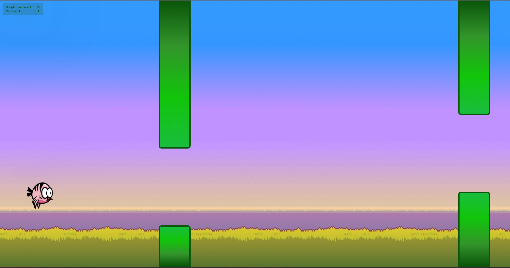
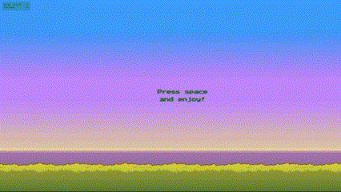

### Screenshot




### Links

- URL: [Game](https://flappybirdbilska.netlify.app/)

### Built with

- HTML5
- CSS
- JavaScript

### I am proud of 

```js
 if (getPassedPipesCount() >= 25) {
            subtitle.textContent = `WOW! TEACH ME MASTER! You passed ${getPassedPipesCount()} pipes`
        } else if (getPassedPipesCount() >= 10) {
            subtitle.textContent = `WOW! Nice! You passed ${getPassedPipesCount()} pipes`
        } else if (getPassedPipesCount() >= 5) {
            subtitle.textContent = `Do better next time! You passed ${getPassedPipesCount()} pipes`
        } else {
            subtitle.textContent = `LOOOOSER! You passed ${getPassedPipesCount()} pipes`
        };
```

### Useful resources

- [CSS Box Model](https://www.youtube.com/watch?v=rIO5326FgPE)
- [JavaScript Event Listeners](https://www.youtube.com/watch?v=XF1_MlZ5l6M)
- [background-size](https://developer.mozilla.org/en-US/docs/Web/CSS/background-size)


## Author

- Based on - [this tutorial](https://www.youtube.com/watch?v=Jgst0rihJ3o)

